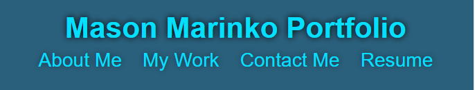
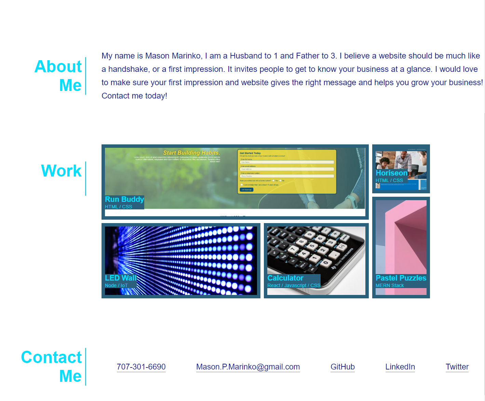
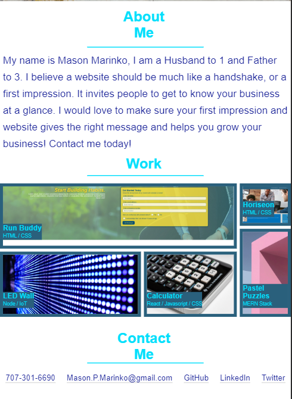
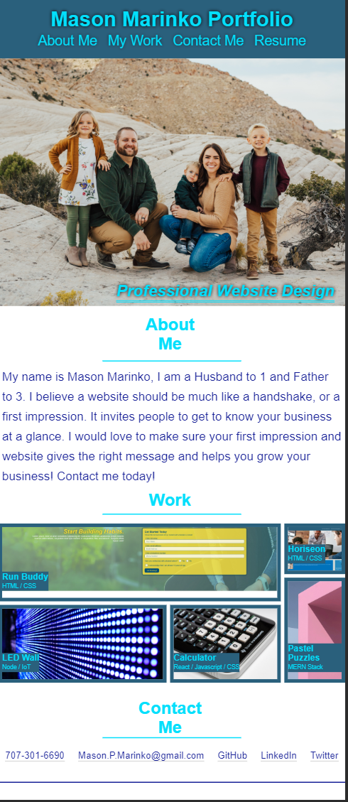

# portfolio
Mason Marinko Portfolio

URL For Website: https://masonmarinko.github.io/portfolio/

URL For Repository: https://github.com/MasonMarinko/portfolio

# GIVEN I need to sample a potential employee's previous work

    - Website has all of my current portfolio information, including Name, Photograph (and my family), brief section about me and how I can help your business, past projects as well as contact information (Phone Number, Email Address, Github, LinkedIn, and Twitter)

## WHEN I load their portfolio
## THEN I am presented with the developer's name, a recent photo, and links to sections about them, their work, and how to contact them

    - Name is first thing on page, photo is most recent of myself and my family, all links work properly, including Resume which leads to Google Drive. Pictures of previous work link to my work as well as has placeholders for future work.

## WHEN I click one of the links in the navigation
## THEN the UI scrolls to the corresponding section

    - All links go to their intended section, including Resume.

## WHEN I click on the link to the section about their work
## THEN the UI scrolls to a section with titled images of the developer's applications

    - All top links function properly, selecting My Work will lead you to the work section of my page which includes thumbnail pictures, text indicating what each project was named as well as the disciplines required to finish said job.

## WHEN I am presented with the developer's first application
## THEN that application's image should be larger in size than the others

    - Run-Buddy which is my first website build (and ongoing) has the largest photo/clickable area than all the rest.

## WHEN I click on the images of the applications
## THEN I am taken to that deployed application

    - 2 of the 5 lead you to previous work, other 3 are currently placeholders and only require a URL for future use.

## WHEN I resize the page or view the site on various screens and devices
## THEN I am presented with a responsive layout that adapts to my viewport

    - Website is proficient on PC Browser, small screen PC Browser, Tablet, and Smartphones. When going smaller the website completely transforms in order to make space and have a cleaner design.

    - Navigation bar contains header, All links take you to appropriate links on page, Resume takes you to my resume on Google Drive.

    - This header image shows what happens when it is transformed into a smaller browser, tablet or cell phone. 

    - Hero image of myself and my family, resizes properly depending on platform, also has a title feature for accessibility. When mouse is held over image it will display the title which reads, "Marinko Family Picture, from left to right, Mason, Knighton, Brittany and Maddox".

 

    - Main body of page when at normal resolution, About Me, Work, and Contact is located to left of body.

 

    - This image shows the main body of webpage when reduced to smaller browser, tablet or cell phone. About Me, Work, and Contact Me moves to top of body. Header also changes, Mason Marinko Portfolio rotates above links.

 

    - Entire page when viewed on a cell phone (Iphone X Specifically), header, titles, text, and grid re size in order to fit and easier to read.

  
 